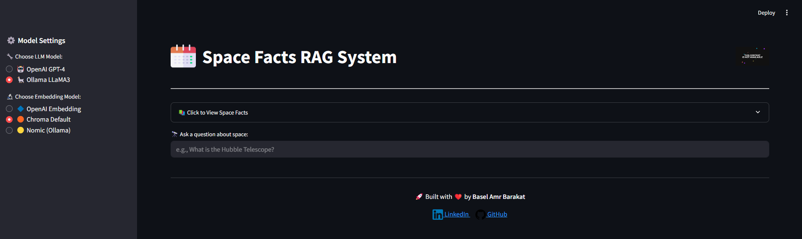
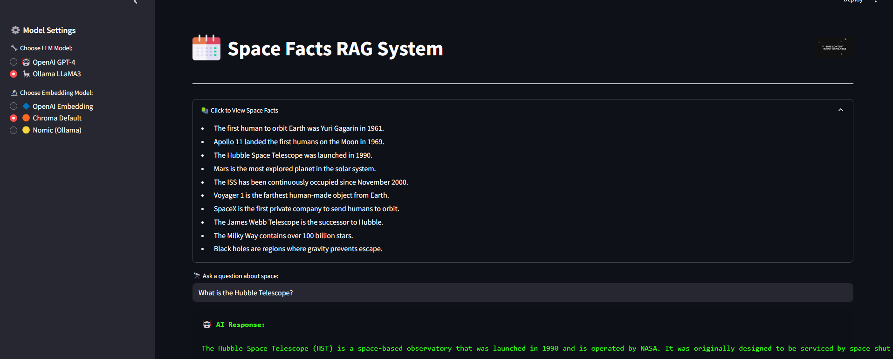

# 🚀 Space Facts RAG App

An interactive, AI-powered question answering system about **space facts**, built using **Retrieval-Augmented Generation (RAG)** architecture, **ChromaDB**, and **Streamlit**. This project allows users to choose between different **LLMs** and **embedding models**, and leverages RAG to provide contextually relevant answers in real-time.

> 📽️ **[Watch Demo Video](Assets/demo_video.mp4)** *(click to view)*

---

## 🌟 Features

- 🔍 Ask any question about space—get detailed, context-aware answers
- 🧠 Switch between OpenAI GPT-4 or Ollama LLaMA3
- 📌 Supports multiple embedding models: OpenAI, Chroma, and Nomic
- ✨ Animated AI response UI with real-time prompt debugging
- 📚 Expandable list of space facts for exploration
- 🌐 Fully interactive and visually enhanced via HTML/CSS

---

## 🖼️ App Preview

| Home Interface | AI Response with RAG |
|----------------|----------------------|
|  |  |

---
## Architecture

---
## 🧰 Tech Stack

| Tool          | Purpose                                |
|---------------|----------------------------------------|
| `Streamlit`   | UI/UX framework                        |
| `ChromaDB`    | Vector database for embedding storage  |
| `OpenAI` / `Ollama` | LLMs for natural language generation |
| `Custom CSV`  | Space facts knowledge base             |
| `HTML/CSS`    | Enhanced UI and animation              |

---

## 🚀 Getting Started

### 1️⃣ Clone the Repo

```bash
git clone https://github.com/Basel-Amr/space-facts-rag-app.git
cd space-facts-rag-app
```
### 2️⃣ Install Requirements
```bash
pip install -r requirements.txt
```

### 3️⃣ Run the App
```bash
streamlit run app.py
```
<<<<<<< HEAD

### ⚙️ Configuration
The sidebar inside the app allows you to:
-  Select between GPT-4 or LLaMA3 models
-  Choose an embedding model: OpenAI / Chroma / Nomic

=======

### ⚙️ Configuration
The sidebar inside the app allows you to:
-  Select between GPT-4 or LLaMA3 models
-  Choose an embedding model: OpenAI / Chroma / Nomic
>>>>>>> a2eebf1dfdf343a3fb2aaf564f41bbc3674a3396
